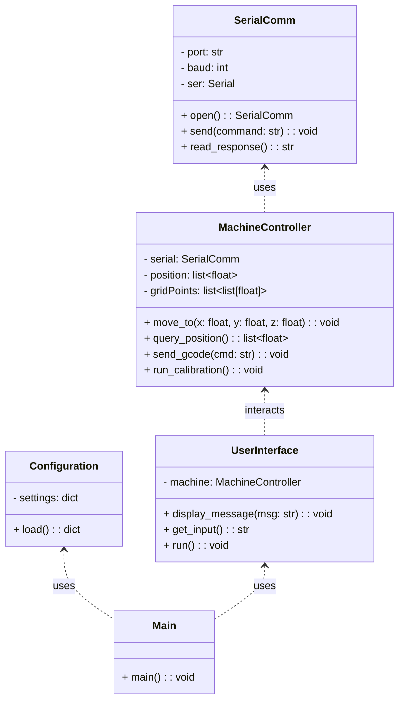

```mermaid
classDiagram
    %% Configuration Module
    class Configuration {
      - settings: dict
      + load() : dict
    }
    
    %% Serial Communication Module
    class SerialComm {
      - port: str
      - baud: int
      - ser: Serial
      + open() : SerialComm
      + send(command: str) : void
      + read_response() : str
    }
    
    %% Machine Control Module
    class MachineController {
      - serial: SerialComm
      - position: list~float~
      - gridPoints: list~list[float]~
      + move_to(x: float, y: float, z: float) : void
      + query_position() : list~float~
      + send_gcode(cmd: str) : void
      + run_calibration() : void
    }
    
    %% User Interface Module
    class UserInterface {
      - machine: MachineController
      + display_message(msg: str) : void
      + get_input() : str
      + run() : void
    }
    
    %% Main module (entry point)
    class Main {
      + main() : void
    }
    
    %% Relationships
    Configuration <.. Main : uses
    SerialComm <.. MachineController : uses
    MachineController <.. UserInterface : interacts
    UserInterface <.. Main : uses
```